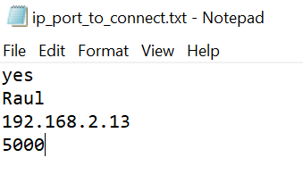

# Multiplayer game using pygame and raycasting algorithm
### Textured Raycasting with projectile and player sprite casting
### Created using python (3.8.2) and pygame library (1.9.6): https://www.pygame.org/

### Good website I used to learn about the algorithm used for the raycasting part (in C++): 
### https://lodev.org/cgtutor/raycasting.html
## Usage:

* Usage: 
    1. Download all the files
    2. If you want to just test as a single player, just run **client.py
    3. If you want to play multiplayer, edit first **ip_port_to_connect.txt
    4. Change the first line in **ip_port_to_connect.txt** from **no** to **yes
    5. Second line in  **ip_port_to_connect.txt** is your nickname
    6. Check your IP within your **router network** and change the third line in **ip_port_to_connect.txt** to yours
    7. Fourth line in **ip_port_to_connect.txt** is the port to connect. Don't change this as it is hardcoded on the server part for now
    8. Run **server.py** before any client connection and let it stay open
    9. Run as many **client.py** you want (I only tested with 3 on same computer as it affects fps ingame)
    10. If you run clients from another computer, remember to change the text file and put the IP address of the machine that is running the server
    11. If you want to connect over the internet, make sure the machine running the server has port forwarded port 5000 and let the IP in the client's txt file be the external IP of the server
    Example:

    
* Controls:
    * W A S D: move the player
    * Right, Left Arrows: turn the player camera
    * Mouse move: moves the camera horizontally
    * Mouse Left click or spacebar: Shoots a projectile
    * Right click: toggle mouse cursor visibility
